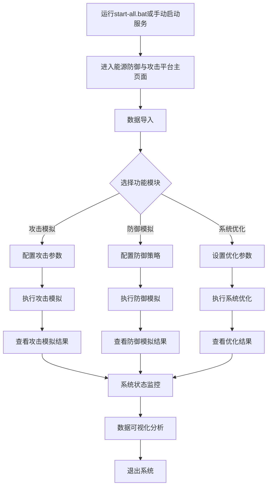
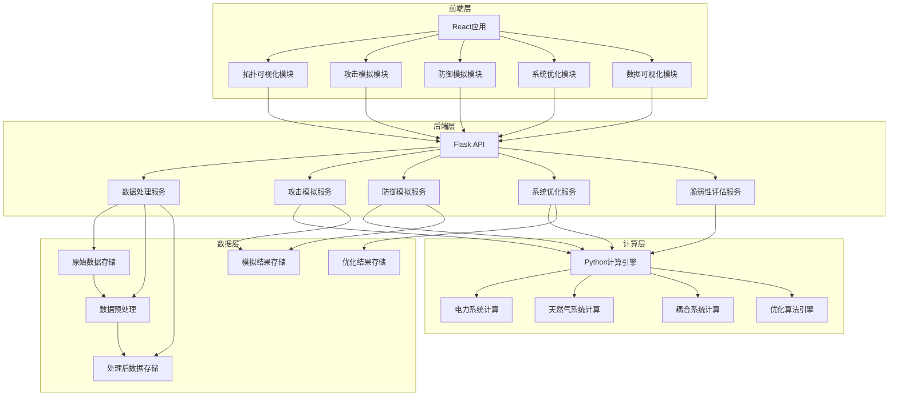

# 1.5 系统开发流程图

## 1.5.1 系统流程图

## 1.5.2 流程图说明

### 1. 系统启动
- **操作**：运行根目录下的`start-all.bat`脚本，或手动启动后端服务和前端应用
- **后端启动**：在`backend`目录下执行`python app.py`
- **前端启动**：在`frontend`目录下执行`npm run dev`
- **结果**：启动完成后，系统将在浏览器中自动打开（或手动访问指定URL）

### 2. 进入系统主页面
- **页面内容**：显示能源网络拓扑图，包含电力系统和天然气系统的耦合展示
- **主要组件**：拓扑图可视化区域、左侧功能面板、右侧状态面板
- **功能**：支持拓扑图的缩放、平移、旋转和节点/边信息查询

### 3. 数据导入
- **操作**：通过左侧功能面板的"数据导入"功能上传能源系统数据
- **支持格式**：Excel、CSV等格式的数据文件
- **数据类型**：电力系统数据、天然气系统数据、耦合系统数据
- **结果**：数据导入成功后，拓扑图将更新为导入的数据

### 4. 功能模块选择

#### 4.1 攻击模拟
- **操作**：在左侧功能面板中选择"攻击模拟"模块
- **配置**：设置攻击类型、攻击目标、攻击强度等参数
- **执行**：点击"开始攻击"按钮，系统将模拟攻击过程
- **结果**：生成攻击模拟结果，包括攻击路径、系统损伤、成本增加等

#### 4.2 防御模拟
- **操作**：在左侧功能面板中选择"防御模拟"模块
- **配置**：设置防御策略、防御资源分配、防御强度等参数
- **执行**：点击"开始防御"按钮，系统将模拟防御过程
- **结果**：生成防御模拟结果，包括防御效果、系统恢复情况、防御成本等

#### 4.3 系统优化
- **操作**：在左侧功能面板中选择"系统优化"模块
- **配置**：设置优化目标、优化约束、优化算法等参数
- **执行**：点击"开始优化"按钮，系统将执行优化计算
- **结果**：生成优化结果，包括优化成本、资源分配、系统效率等

### 5. 结果查看

#### 5.1 攻击模拟结果
- **页面**：右侧面板切换到"攻击模拟结果"标签
- **内容**：
  - 攻击路径可视化
  - 系统损伤评估
  - 成本增加分析
  - 攻击目标达成情况
  - 最佳攻击策略展示

#### 5.2 防御模拟结果
- **页面**：右侧面板切换到"防御模拟结果"标签
- **内容**：
  - 防御效果评估
  - 系统恢复情况
  - 防御成本分析
  - 最佳防御策略展示

#### 5.3 优化结果
- **页面**：右侧面板切换到"系统状态监控"标签
- **内容**：
  - 优化后的系统成本
  - 资源分配情况
  - 系统效率提升
  - 优化前后对比

### 6. 系统状态监控
- **页面**：右侧面板的"系统状态监控"标签
- **内容**：
  - 发电机输出实时监控
  - 流量分布实时监控
  - 节点状态实时监控
  - 系统成本实时计算

### 7. 数据可视化分析
- **操作**：点击页面上的"图表"按钮，打开数据可视化面板
- **内容**：
  - 系统总成本趋势图
  - 攻击目标值对比图
  - 发电机输出柱状图
  - 流量分布饼图
- **功能**：支持图表类型切换、数据筛选、图表导出等

### 8. 退出系统
- **操作**：关闭浏览器窗口或停止后端/前端服务
- **结果**：系统停止运行，所有临时数据将被清除

## 1.5.3 系统功能关系

系统各功能模块之间存在密切的关系：

1. **数据导入是基础**：所有功能模块都依赖于导入的能源系统数据
2. **攻击模拟与防御模拟相互关联**：防御模拟可以基于攻击模拟的结果进行，评估防御策略对攻击的效果
3. **系统优化贯穿始终**：无论是攻击前还是防御后，系统都可以进行优化，提高系统的效率和可靠性
4. **系统状态监控是核心**：实时监控系统状态，为其他功能模块提供数据支持
5. **数据可视化是辅助**：将复杂的数据转化为直观的图表，帮助用户理解系统运行情况

## 1.5.4 系统数据流

1. **数据导入** → **拓扑图更新** → **系统状态初始化**
2. **攻击模拟配置** → **攻击模拟执行** → **攻击结果生成** → **系统状态更新**
3. **防御模拟配置** → **防御模拟执行** → **防御结果生成** → **系统状态更新**
4. **系统优化配置** → **优化计算执行** → **优化结果生成** → **系统状态更新**
5. **系统状态数据** → **数据可视化处理** → **图表生成**

## 1.5.5 系统使用建议

1. **首次使用**：建议先导入示例数据，熟悉系统功能和操作流程
2. **功能顺序**：建议按照"数据导入" → "系统状态监控" → "攻击模拟" → "防御模拟" → "系统优化"的顺序使用
3. **参数调整**：在进行攻击、防御或优化模拟时，建议逐步调整参数，观察结果变化
4. **结果分析**：结合系统状态监控和数据可视化分析，全面理解模拟结果
5. **数据保存**：重要的模拟结果建议导出保存，以便后续分析和对比

## 1.5.6 系统扩展说明

系统设计支持功能扩展，未来可以添加以下功能：

1. **更多攻击类型**：支持新型攻击方式的模拟
2. **更多防御策略**：支持新型防御技术的模拟
3. **更复杂的优化算法**：支持多目标优化、鲁棒优化等高级优化算法
4. **预测分析功能**：基于历史数据进行系统状态预测
5. **AI辅助决策**：利用人工智能技术辅助攻击/防御策略制定和系统优化

# 1.6 系统架构图

## 1.6.1 系统架构

## 1.6.2 架构说明

1. **前端层**：基于React和TypeScript开发，负责用户界面展示和交互
2. **后端层**：基于Flask开发的RESTful API，负责处理前端请求和业务逻辑
3. **数据层**：负责数据的存储、预处理和管理
4. **计算层**：基于Python计算引擎，负责复杂的计算任务

系统采用前后端分离的架构设计，各层之间通过API进行通信，具有良好的可扩展性和可维护性。